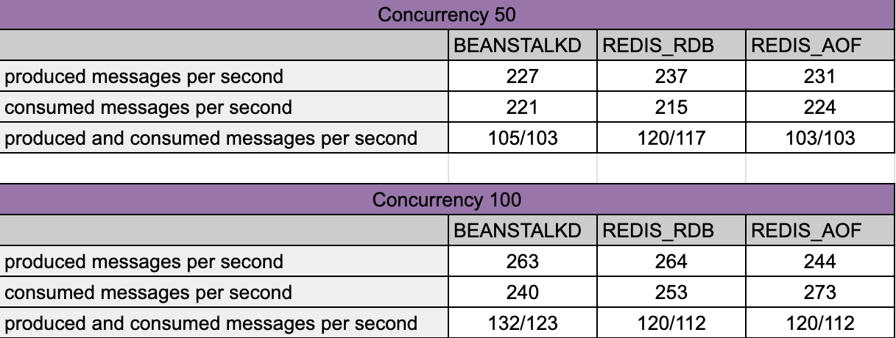

# Queues: Redis, Beanstalkd

### Instructions
1. Run `docker-compose up -d` so three containers start: beanstalkd, redis rdb and redis aof
2. Run one of the siege scripts `siege-publish`, `siege-consume` or `siege-publish-consume` passing the `queue` parameter (one of the values from `QueueNameEnum`)
3. Check the logs and obtain testing results

### Conclusions
Beanstalkd appears to perform consistently well, especially as concurrency increases. 
Redis, while generally strong, shows variability depending on the persistence method chosen, with RDB being slightly better for writes at moderate concurrency and AOF handling reads better at high concurrency.
These results suggest that the optimal choice depends on your specific workload and concurrency needs. For high write-throughput, Redis with RDB may be preferable, while for a balanced workload or higher reliability, Redis with AOF might be a better choice. If your focus is on a simple, consistent message queue, Beanstalkd could be ideal.